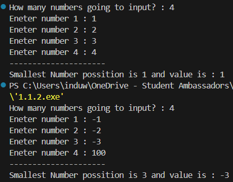
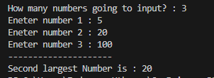
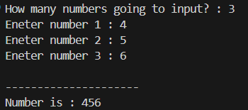
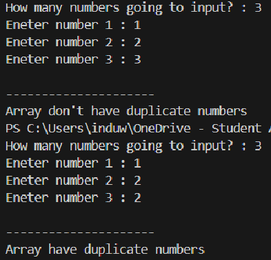
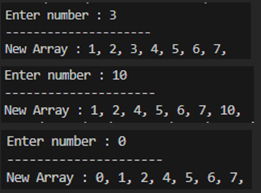
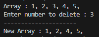

# IS1214 - Data Structures and Algorithms
## Assignment 1 - Array Operations

> 📄 **Assignment PDF**: [Practical 01.pdf](./Practical%2001.pdf)

This repository contains solutions for Assignment 1, focusing on array manipulations in C.

## 📢 Note

This repository contains my answers for the first DSA practical assignment. I am sharing this with everyone who loves to learn Data Structures and Algorithms.

- **Authenticity**: All codes are written by me based on my own knowledge and are **not AI-generated**.
- **Continuous Learning**: As I am still learning, there might be logical errors or more optimal approaches/algorithms for these problems.
- **Feedback**: I am open to all different approaches! If you find a better way to solve a problem, please feel free to open an **ISSUE**. I would love to know your opinions and suggestions.

## 📋 Activity List & Solutions

### Activity 1.1: Basic Array Operations

| # | Problem Description | Source Code | Executable | Output Preview |
|---|---------------------|:-----------:|:----------:|:--------------:|
| 1 | **Find Mean**: Calculate the mean of `n` numbers using arrays. | [`1.1.1.c`](./1.1.1.c) | [`a.exe`](./output/a.exe) |  |
| 2 | **Smallest Position**: Find the position of the smallest number among `n` numbers. | [`1.1.2.c`](./1.1.2.c) | [`1.1.2.exe`](./output/1.1.2.exe) |  |
| 3 | **Second Largest**: Find the second largest of `n` numbers. | [`1.1.3.c`](./1.1.3.c) | [`1.1.3.exe`](./output/1.1.3.exe) |  |
| 4 | **Form Number**: Enter `n` digits and form a number using them. | [`1.1.4.c`](./1.1.4.c) | [`1.1.4.exe`](./output/1.1.4.exe) |  |

### Activity 1.2: Duplicates

| Problem Description | Source Code | Executable | Output Preview |
|---------------------|:-----------:|:----------:|:--------------:|
| **Check Duplicates**: Determine whether an array of integers contains a duplicate number. | [`1.2.c`](./1.2.c) | [`1.2.1.exe`](./output/1.2.1.exe) |  |

### Activity 1.3: Insertion

| Problem Description | Source Code | Executable | Output Preview |
|---------------------|:-----------:|:----------:|:--------------:|
| **Insert Sorted**: Insert a number into an array that is already sorted in ascending order. | [`1.3.c`](./1.3.c) | [`1.3.exe`](./output/1.3.exe) |  |

### Activity 1.4: Deletion

| Problem Description | Source Code | Executable | Output Preview |
|---------------------|:-----------:|:----------:|:--------------:|
| **Delete Sorted**: Delete a number in an array that is already sorted in ascending order. | [`1.4.c`](./1.4.c) | [`1.4.exe`](./output/1.4.exe) |  |

### Activity 1.5: Merging

| # | Problem Description | Source Code | Executable | Output Preview |
|---|---------------------|:-----------:|:----------:|:--------------:|
| 1 | **Merge Two**: Merge two arrays. | [`1.5.1.c`](./1.5.1.c) | [`1.5.1.exe`](./output/1.5.1.exe) |  |
| 2 | **Merge Any**: Extend the above program to merge any number of arrays. | [`1.5.2.c`](./1.5.2.c) | [`1.5.2.exe`](./output/1.5.2.exe) |  |

---
*University of Colombo School of Computing - IS1214*
